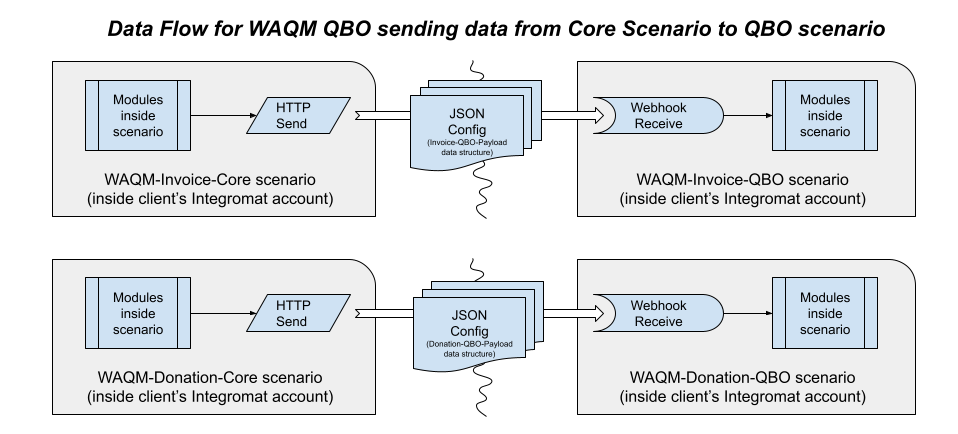
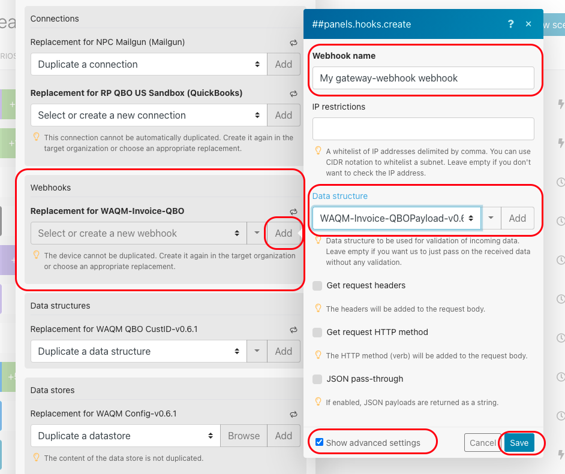
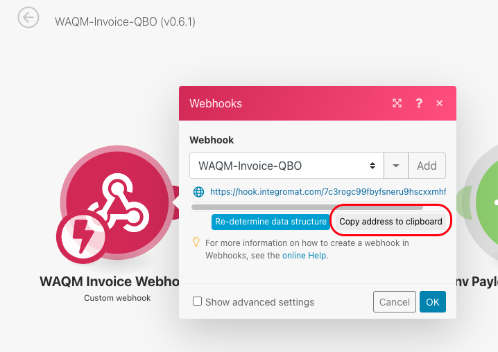
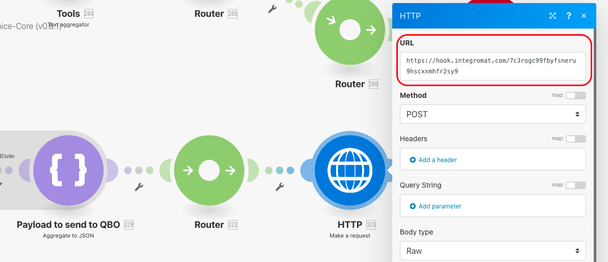
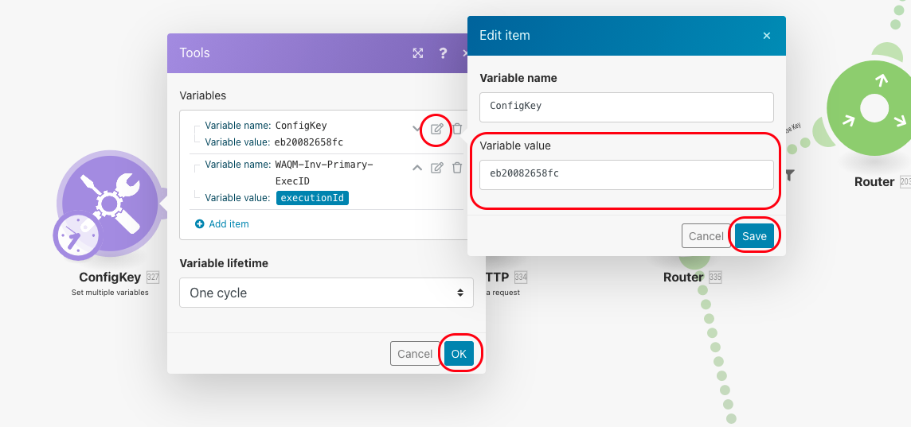

# Detailed Install Steps

These are the detailed steps to install the components of WAQM into a new client's Integromat instance.   An overview of the installation process is described on this page.   [WAQM Installation Overview](../waqm-overview-1/waqm-installation-overview.md)

**A\) Clone Data Structures** \([https://www.integromat.com/udts/197209](https://www.integromat.com/udts/197209)\): _From the NPC Integromat organization, clone each Data Structure below to the client’s organization. Update the name, select the client’s org as the target. Recommendation: update the name to include the client's name and the data structure version number._ 

1. WAQM Config \(required\) 
2. WAQM-Invoice-IIF\_RAW \(required\) 
3. WAQM-Invoice-Line \(required\) 
4. WA-QB-Invoice-IIF\_TRNS \(optional-documentation of structure\) 
5. WA-QB-Invoice-IIF\_SPL \(optional-documentation of structure\) 
6. WAQM QBO Cust ID 
7. WAQM QB Tax Code 
8. WAQM-Invoice-List
9. WAQM-Invoice-QBOPayload
10. WAQM-Donation-QBOPayload

**B\) Create new Data Stores** \([https://www.integromat.com/datastores/](https://www.integromat.com/datastores/)\):  _From the client’s Integromat organization, create the 2 Data Stores shown below. Name the Data Stores, select the corresponding Data Structure, and specify the storage size.   For the name, include the clients name and the version of the corresponding data structure._

1. WAQM-Config \(Use the WAQM-Config Data Structure. Use the minimum storage capacity =1 MB.\) 
2. WAQM-Invoice-TMP \(Use the WAQM-Invoice-IIF\_RAW data structure. The storage capacity may need to vary depending on the number of records. 1-2 MB should be sufficient.\)

**C\) Create a record in the new Config Data Store for the new client**:  _Wild Apricot Quickbooks Manager cannot be tested until the configuration is complete. Option 2 \(copying from previous NPC config record\) is recommended to provide a starting point for configuring WAQM to a client’s needs. Before copying, ensure there is no confidential information from a different client in the config record._ 

**C-1:  Option 1 - manual:**  Go to the Data Store, Browse, Add record, enter config details, and Save. 

1. Reference a record in NPC’s organization. 
2. Manually add a record and configure per the client’s needs. Reference client’s mapping sheet and the Data Store Config section of this document for guidance.

**C-2:  Option 2 - “create” from a previous config record in NPC Lab:** \(see diagram for pictorial representation\)

1. In the originating Integromat Organization \(NPC Lab\), clone this scenario to the target organization: WAQM-DS-Config-Webhook. During the clone process, check these configurations: 
   1. Add a new Webhook connection \(choose any name as this a Temporary connection that is not needed after the config is copied\) 
   2. Ensure the Config Data Store module points to the newly created Config Data Store in the target organization.

                
2. From the cloned scenario inside the target organization, copy the URL address from the Webhook module. This will be used back in the originating organization. 
3. Save and turn on the cloned Webhook scenario in the target organization.  
   NOTE:  If the first Webhook module indicates that data structure determination is needed, running the scenario in step v.\) \(WAQM-DS-Config-SendJSON\) will need to be run twice. The first run “trains” the webhook to recognize the data structure. The 2nd run actually creates the new config record in the target organization. For further info, see: [https://support.integromat.com/hc/en-us/articles/360006249313-Webhooks](https://support.integromat.com/hc/en-us/articles/360006249313-Webhooks).

             

4. In the originating organization \(NPC Lab\), check the config of the scenario: WAQM-DS-Config-SendJSON 
   1. Go into the NPC organization’s WAQM Data Store and confirm which record will be copied to the client. Copy the key for the record.

                

   2. Ensure the “key” in the first Data Store module corresponds to the proper config record to be sent to the target organization

                

   3. Check the URL in the HTTP request module \(from step ii above\). Ensure it matches the URL copied from the Cloned scenario inside the target organization.

      
5. Run the scenario in the originating org \(NPC Lab\): WAQM-DS-Config-SendJSON 
6. In the target organization, confirm that the Webhook ran successfully. Confirm that the record was created in the Data Store in the target organization. NOTE: If the receiving scenario did not run properly or add a Config record to the new data store, it is possible that the new Webhook needed to be “re-trained” to recognize the data structure. See description and integromat support URL in step iii\) above. 
7. Edit the newly created Config record in the Target Organization as needed to match the clients needs. 
8. The Webhook Scenario may be deleted inside the Target Organization after the Config record is created.

**D\) Clone scenarios from NPC’s organization to the client’s organization** 

1. WAQM-Invoice-Core \(latest version\) 
2. WAQM-Invoice-QBO \(latest version\) \[For QBO clients only\]
3. WAQM-Donation-Core \(latest version\)
4. WAQM-Donation-QBO \(latest version\) \[For QBO clients only\]
5. WAQM-Config-BackupRecord \(used for maintenance purposes\)      

IMPORTANT NOTE: During the clone process, you will be asked to update the connections, webhooks, and data stores. If the connections are new, login information may be needed to complete the clone process. 

If the scenarios in this section use _**webhooks**_, a new webhook must be created inside the client's account as part of the cloning process.  See the next section for detailed instructions about Webhooks and the corresponding HTTP Send modules inside the scenarios.

**E\) Create webhook and update the HTTP Send URL \(only needed if the cloned scenarios in the previous section use Webhooks\)**

The webhook allows information from the Core scenario to be passed to a secondary scenario.   \(See the screenshot for an example.\) 

* Give the webhook a name that includes the client name, scenario reference and data structure version number.   
* Choose the appropriate data structure.  Use the table below to understand which scenarios and data structures are related.

| Scenario Containing a Webhook | Data Structure to use | Recommended Webhook Name | Scenario with corresponding HTTP Send |
| :--- | :--- | :--- | :--- |
| WAQM-Invoice-QBO | WAQM-Invoice-QBOPayload | WAQM-QBO-Inv-\[version\]-\[client\] | WAQM-Invoice-Core |
| WAQM-Donation-QBO | WAQM-Donation-QBOPayload | WAQM-QBO-Don-\[version\]-\[client\] | WAQM-Donation-Core |

After the Webhook is created, the URL from the Webhook must be copied to the HTTP Send module of the corresponding scenario.  Follow steps and see the screenshots for an example.

1. Open the scenario that includes the Webhook
2. Open the first module, which is the Webhook module
3. Copy the URL using the "copy address to clipboard" button \[do not ave any changes\]
4. Close the scenario
5. Open the corresponding "Core" scenario
6. Find the HTTP Make a Request module with the corresponding name.  It is usually to the far right of the scenario.
7. Open the HTTP Make a Request module
8. Paste the URL from the webhook into the URL field inside the HTTP Make a Request module
9. Press OK and Save the scenario

NOTE: This process is expected to work as-is.  Sometimes the Webhook must be "trained" to recognize the data structure.  This Integromat article describes the process.  [https://support.integromat.com/hc/en-us/articles/360006249313-Webhooks](https://support.integromat.com/hc/en-us/articles/360006249313-Webhooks).

\*\*\*\*

**F\) If needed, change all 3 scenarios to work for the client’s environment:** 

1. Configuration record key in the 1st module to read proper record from the Config Data Store  See the screenshot for an example.

             

2. Ensure any test filters are removed \(e.g. Invoice ID = \#\#\) 
3. Output modules for Box, DropBox, etc. \(folder, filename format, etc.\).
4. NOTES: 
   1. Box folder paths must be manually selected after cloning; they cannot be configured through the Data Store. 
   2. If a storage service is not used, it may need to be deleted from the cloned scenario to prevent warnings.

