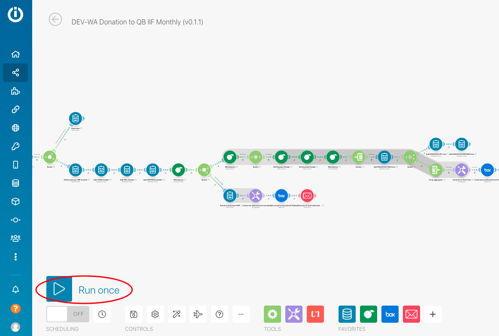

# QBWA Scheduling Options

### Changing Scheduling Configuration and Running Manually

The QBWA Core scenarios may be set-up to run on a specific schedule automatically or they may be run manually for a defined set of start and end dates or a specific document number. The Document Date on the transaction is used to find documents for the specified time periods.

The scheduling features must be set for each transaction type separately.  They all work consistently.

Review the [QBWA Configuration Guide](../qbwa-config-reference/waqm-configuration-guide.md#waqm-scheduling-configuration) scheduling section from more details on the Scheduling Settings.

### **Automatic Scheduling**

**A) Data Store Config:** In the configuration Data Store, go to the proper record and move to the Scheduling section for the desired transaction type.

1. Make sure the “activation” field is set to Yes
2. In the Scheduling Type field use: Scheduled
3. Go to the Auto Scheduled config section for the transaction
4. Choose the desired Time Period (exactly):  Monthly, Weekly, or Daily
5. Choose the number of Time Periods (an integer number)
6. If Weekly is chosen, define the 3-character day of week on which the job should run (e.g. Mon, Tue, Thu)
7. If Monthly is chosen, define the integer number representing the day of month on which the job should run  (e.g. 1 --> 1st day of month)
8. For reference, enter the time of day the job should start.  Ensure that the time is offset for different transaction types to avoid conflicts.
9. Save Record

**B) Core Scenario Config:** Go to each "Core" Scenario that is in scope and set-up the schedule: (see screenshot)

1. Go to the scenario.
2. In the upper right, select Scheduling from the Options menu. (If you don’t see the option, you may be in edit mode. Exit the edit mode.)
3. Choose the Run Scenario - "Every Day"
4. Enter the time to start the run. The same time that was entered in the config data store for this transaction type.
5. Click OK
6. Make sure the scenario toggle is turned "On" in the upper right corner.

**C) Transaction Loader Scenario Config (QBD or QBO):**  Make sure the scenario is turned "On" in the upper right corner.

NOTES:

* Remember to use different start times for each transaction type and offset them by 15 minutes or more. &#x20;
* For Quickbooks Online, the start time for Invoice transactions should occur before Payment transactions.  This allows Payments to be linked to the invoices.
* Even though the scenario runs "every day" there is logic inside the scenario that determines whether the run matches the scheduling settings or not.

### **Running Manually**

**Data Store Config:** In the configuration Data Store, go to the proper record and move to the Scheduling section for the desired transaction type.

1. Make sure the “activation” field is set to Yes
2. In the Scheduling Type field use: Manual
3. In the Manual Start Date field, enter the date in YYYY-MM-DD hh:mm A format
4. In the Manual End Date field, enter the date in YYYY-MM-DD hh:mm A format
5. Optionally:  Enter the Document number for a specific transaction to only run for that specified transaction.  The transaction date must be within the start and end dates above.
6. Save Record
7. Confirm that the Transaction Loader Scenario (QBD or QBO) is turned "On".
8. Go to the Core Scenario for the transaction and run
   1. Go to the Core scenario
   2. Click and make sure it is in the Edit mode
   3. Click the Run Once button on the bottom left
   4. Exit the scenario and Discard Changes if prompted.
9. If the scenario was previously in an AutoRun Scheduled mode, don't forget to turn the setting back to Scheduled.

###
