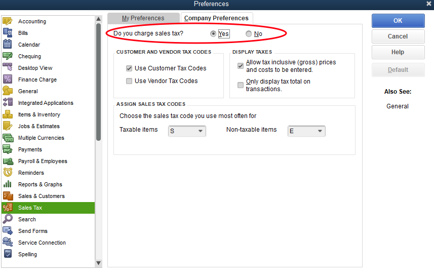
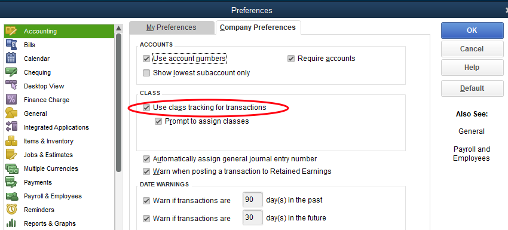
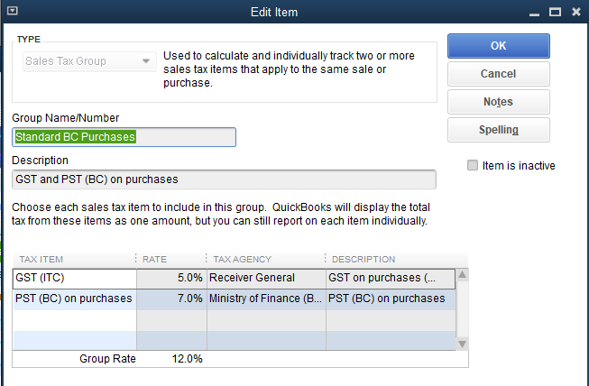
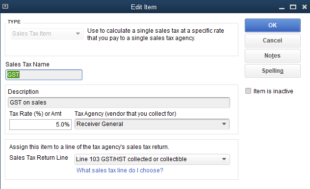

# Quickbooks Config Assumptions

### Overview

WAQM’s configuration is defined inside of Make.com and is intended to map transactions from Wild Apricot to QuickBooks. WAQM creates IIF files formatted for import into QuickBooks Desktop or creates invoices directly inside Quickbooks Online.

This section describes the QuickBooks configuration that is expected to be in place to support WAQM. Most companies using QuickBooks will have an established configuration already. In most cases, the QuickBooks configuration can continue to be used as-is. In some cases, recommendations may be made to align with Wild Apricot usage.

Though QuickBooks Desktop has some functionally allowing Items, Accounts, and Taxes to automatically be created on IIF import, this is NOT recommended. These automatically created items are not fully set-up inside QuickBooks Desktop and can lead to unpredictable behavior. The one exception is Classes; they can be defined up-front in QuickBooks Desktop or can be created “on the fly” during IIF import to QuickBooks Desktop. Quickbooks Online does not support this capability; Classes must be defined before used to create an invoice.

**General QB Configuration**

* Sales Taxes must be enabled if Sales Taxes are used inside WildA Apricot. &#x20;

* If a client expects to use Classes inside Quickbooks, “Use class tracking” must be enabled (Transaction Settings/Preferences for the Company file).  NOTE:  If enabled, Quickbooks expects every transaction to have a Class specified in Quickbooks.

.png>)

**Customer Name and Billing Address**

Quickbooks uses a customer's "Display Name" as the unique identifier to distinguish different customers.  Quickbooks prevents different customers from having the same "display name".  To ensure financial transactions are connected to the proper customers inside Quickbooks, Wild Apricot and WAQM should use the same naming convention as is used for Quickbooks.   (e.g.  Last Name, First Name).   This also helps prevent duplicate customers from being created that may use a different Display Name format.

For the Quickbooks Online version, WAQM will search for an existing customer using the "Display Name".  If a customer is not found, WAQM will create a new customer using the Wild Apricot data.

The mailing address from Wild Apricot is used as the Billing Address on the financial documents created inside Quickbooks.  &#x20;

Quickbooks Desktop provides 5 "lines" for the Billing Address; some options exist to use standard Wild Apricot values to populate these fields using your Billing Address conventions.   See the related section inside the [waqm-configuration-guide.md](waqm-configuration-guide.md "mention")to understand the available options.

NOTE: Quickbooks also prevents duplicate "display names" across Customers, Vendors, and Employees; in some cases, a display name may need to be modified if the same person may exist as a Customer, Vendor, and/or Employee.

**Accounts**

These types of Accounts must be defined in Quickbooks to support WAQM.  If new accounts are created or accounts are edited after WAQM is setup, the corresponding WAQM configuration must be updated.

* Receivables Account: Represents funds that are due to a company, but yet received. Many organizations will use a single AR account, but it is possible to have multiple AR accounts for multiple purposes.
* Income (Revenue) Account: An account representing the income generated from a Sales Item. It is common to have multiple income accounts. It is recommended to use income accounts that will be fairly stable instead of creating new Income Accounts frequently.
* Sales Tax Payable Account: If Sales Taxes are used, this represents the Sales Taxes that are expected to be paid to Taxing authorities.
* Deposit-To Account:  For payments (and Donations), it is typical to have a "Undeposited Funds" account.  This allows received funds to be placed into this account and to later be reconciled with actual deposits to a bank account.   It is also feasible to directly specify a "deposit to" account that represents a bank account.  It is also feasible to map different "deposit-to" accounts for different types of transactions.

The recommended practice is to limit the number of accounts used. If further granularity is desired, classes and subclasses may be used in reporting.

NOTES:

* If an account is created during IIF import, it is automatically defined as a “bank” account.
* The example below is for illustration only. The list of chart accounts is filtered to show accounts with Membership in the name.
  * The list shows both the name and the account number. WAQM only uses the names.
  * “Membership Fees” is a Parent account
  * “Membership Fees:Affiliates Annual Dues” is a child account
  * For QBO, the system ID of the account required.  This is not typically accessible by a user, but may be identified in the QBO URL when reviewing the register for the desired account.  NPC staff has utilities available that can help identify QBO account IDs.

**Sales Products (Inventory List Items)**

Sales Products represent the Services and Goods that are sold by an organization.   At a minimum, WAQM expects one Product to be defined inside Quickbooks for each Wild Apricot Invoice Order Type (Membership, Events, Online Store, Manual Item). This may represent a good or a service. The Item links the Sales item to the proper Income accounts and displays on the Quickbooks internal Invoice.

For Quickbooks Online:  Income accounts are not explicitly mapped by WAQM.  The Product is identified on the invoice and the income accounts are derived from the Quickbooks Product.  If different income accounts will be mapped for different "business rules", it may be necessary to have corresponding Products defined inside Quickbooks.

For Quickbooks Desktop:  The recommended practice is to use a single Product (Inventory List Item) per Order Type, such as “Membership”. This will show n the Invoice along with the specific line item details derived from Wild Apricot (e.g. Gold Membership Level renewal).   Though the Product is used on the invoice, the IIF import file allows a separate income account to be used.  If further granularity is desired for the Product, classes and subclasses may be used in reporting.

NOTES:

* The example below shows a list of the Sales Items with “professional” in the name.
* For Quickbooks Desktop:  The account and class defined for a line item in the IIF file overrides the configuration of the Sales Inventory List Item (Product) inside QuickBooks.

**Sub- Accounts, Items, and Classes**

To designate child accounts in WAQM for QBD IIF files, use this format with the Parent and Child separated by a colon if referencing child items.

EXAMPLES:

* Income:Events
* Membership:Professional Memberships

**Tax Related Configuration**

QuickBooks manages taxes differently for US and Canadian versions as well as some differences for Quickbooks Desktop vs Quickbooks Online. Note the Quickbooks version used and which portions of configuration must be maintained.

**Taxes for Canadian (CAD) Quickbooks Desktop versions:**

A simple mapping of tax codes is required for WAQM. Most of the tax calculation is managed by Quickbooks during the import process. Other fields exist inside the WAQM configuration and can be used as a reference.

Sales Tax Item: For each Sales Tax used, a Sales Tax Item must be configured inside Quickbooks. This defines the name, account, tax rate, and taxing agency. The name is used in the WAQM configuration for proper mapping.

Sales Tax Group: For each Sales Tax Group used (a combination of tax rates applied to a single item), a Sales Tax Group must be configured inside Quickbooks. This defines the combination of Tax Rates included in the Tax Group. The name is used in the WAQM configuration for proper mapping.

For both the Sales Tax Item and the Sales Tax Group, a Tax Code is used on the invoice for each line item to specify how the line is taxed.   WAQM uses the mapping to determine this Tax Code and uses it when creating an invoice line item.

The examples below show a list of Sales Tax Items and Sales Tax Groups in addition to the Quickbooks configuration options for each type.

&#x20;

**Taxes for Canadian (CAD) Quickbooks Online versions:**

The Online version of CAD Quickbooks operates very similarly to the CAD Desktop version.

**Taxes for United States (US) Quickbooks Desktop versions:**

Sales taxes must be fully defined and formatted within the IIF file for each invoice. This includes these fields:

* Accounts
* Tax Agency Name
* Tax Rate
* Tax Amount
* Sales Tax List Item

Though these items are defined in the IIF file, it is highly recommended that the same exact configuration of Tax Rates, Tax Names, Tax Agencies, and Tax Accounts exist inside QuickBooks. This will minimize unexpected behavior or confusion.

WAQM configuration maps the Wild Apricot tax names and rates to the corresponding QuickBooks Tax configuration (name, rate, account, tax agency). The WAQM scenario uses the tax rates to calculate the tax amount to list on the invoices. For untaxed invoices, a Sales Tax line with zero tax must still be created to allow IIF import into a QuickBooks Company that has Sales Taxes enabled.

These tax scenarios are supported for for US Quickbooks versions:

* A single tax rate for an entire invoice (different combinations of taxable and non-taxable items are okay)
* Different single tax rates for different line items (uses the Subtotal technique to define a tax line for the Subtotal)
* A single Sales Tax Group for an entire invoice (all line items have the same 2 taxes; taxable and nontaxable items are okay)

Because of Quickbooks US limitations, these tax scenarios are not supported:

* An invoice where some line items have a single tax rate and other line items have 2 tax rates
* An invoice where different combinations of dual tax rates exist on different line items

**QB List Item: Subtotal configuration**

(For some advanced tax scenarios, subtotal is used to group items with the same tax rates. The Integromat scenario only supports a single general “Subtotal” item.)

* Create a List Item = Subtotal (type subtotal)
* If a different Subtotal item already exists (different name), change the Integromat config to use the correct name.

**Prevent Duplicate Invoice and Sales Receipt (Sales) Transactions**

We highly recommend using the setting described below to prevent duplicate Sales transactions from being created inside Quickbooks.  This will prevent a transaction from being created if the transaction number (Invoice number of Sales Receipt number) from being reused. &#x20;

&#x20;         Sales / Custom transaction numbers =ON

NOTE:  Quickbooks does not have a setting to prevent Payment transactions.

The screenshots below show the method to turn on this setting within Quickbooks Online.  Specific client's screenshots may vary depending on their Quickbooks Online account setup.

<figure><figcaption>
Access Account Settings from the Gear icon in the upper right.
</figcaption></figure>

 

<figure><figcaption>
Navigate to Sales and click on the Edit icon.
</figcaption></figure>

 

<figure><figcaption>
Turn the Custom transaction number setting to ON and Save
</figcaption></figure>

