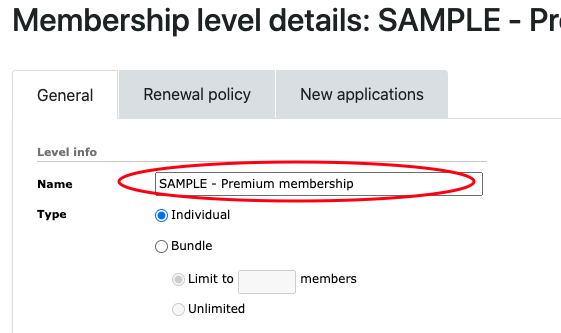
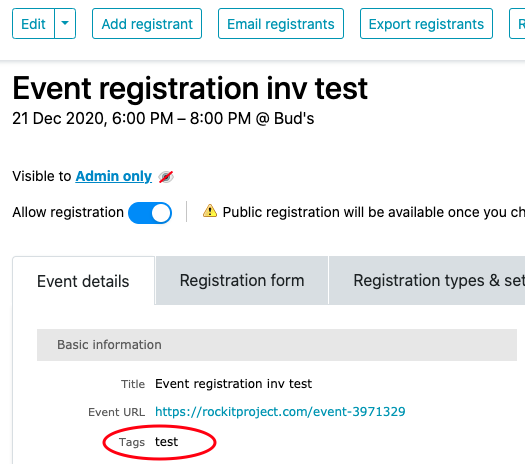
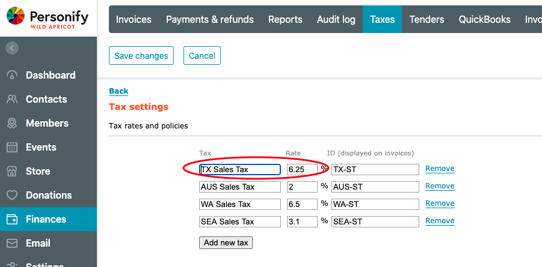

# Wild Apricot Config Assumptions

Each Invoice Order Type depends on different portions of the Wild Apricot configuration:

**Membership**

The Member Level Name is used to drive mappings on all line items of a Membership Invoice. It is also possible to read the name of an Extra Cost field to overwrite the mapping of a specific line item on an invoice.

**Events**

The Event “Tag” is used as the basis for mapping Event invoices.  A Wild Apricot event may have multiple tags.  However, WAQM can only use 1 tag to map to the proper Quickbooks accounts and classes.   The first "matched" tag on an event will be used during QWAQM mapping.

**Online Store**

The design intent is to use Product “Tag” as the basis of mapping Online Store invoices. However, Wild Apricot has a current limitation where this Tag cannot be read through API or Integromat.  At this time, all Online Store items can only be mapped to a single Quickbooks Account, Item, and Class.

**Manual Item**

Manual invoices by nature do not provide any means for systemically mapping to accounts. The WAQM design allows for all “manual” items to be mapped to a specified general “manual” account in Quickbooks. It is recommended that the client plans to manually re-class these “manual” items.

**Sales Tax**

If used, the Sales Tax name and % must exactly match the Tax definition in WAQM. NOTE: WAQM uses the Tax Name.&#x20;

**Donation**

If Donations are used, it is possible to change the mapping for Donation Sales receipts based on a Donation Campaign.  Wild Apricot does not have a standard field for distinguishing Donation Campaigns, but it is typical to have a custom drop-down field allowing the Donor to select a Donation Campaign. &#x20;
